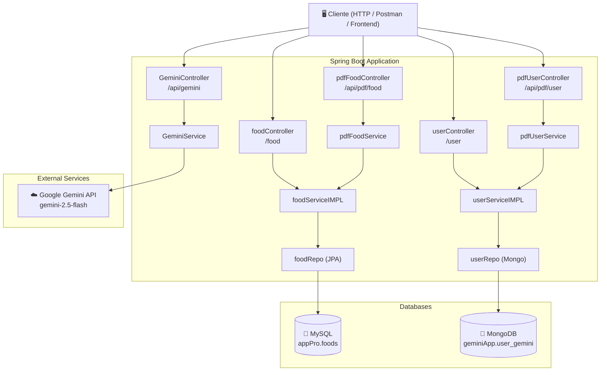

<div align="center">

# 🤖 Proyect Gemini — Spring Boot + Google Gemini AI

[](https://www.oracle.com/java/)
[](https://spring.io/projects/spring-boot)
[](https://ai.google.dev/)
[](https://www.mysql.com/)
[](https://www.mongodb.com/)
[](LICENSE)

> **REST API** full-stack construida con Spring Boot que integra **inteligencia artificial de Google Gemini**, gestión de datos con **MySQL** y **MongoDB**, y generación/lectura dinámica de **archivos PDF**.

[📋 Endpoints](#-documentación-de-la-api) · [⚙️ Instalación](#-instalación-y-configuración) · [🗂️ Estructura](#️-estructura-del-proyecto) · [🤝 Contribuir](#-contribuir)

</div>

---

## 📖 Tabla de Contenidos

1. [✨ Características principales](#-características-principales)
2. [🏗️ Arquitectura](#️-arquitectura)
3. [🛠️ Tecnologías utilizadas](#️-tecnologías-utilizadas)
4. [📋 Requisitos previos](#-requisitos-previos)
5. [⚙️ Instalación y configuración](#-instalación-y-configuración)
6. [🗄️ Base de datos](#️-base-de-datos)
7. [📋 Documentación de la API](#-documentación-de-la-api)
8. [🗂️ Estructura del proyecto](#️-estructura-del-proyecto)
9. [💡 Ejemplos de uso (cURL)](#-ejemplos-de-uso-curl)
10. [🤝 Contribuir](#-contribuir)

---

## ✨ Características principales

| Funcionalidad | Descripción |
|---|---|
| 🤖 **IA con Gemini** | Consultas en lenguaje natural mediante el modelo `gemini-2.5-flash` |
| 🍎 **CRUD de Alimentos** | Gestión completa de alimentos almacenados en **MySQL** vía JPA/Hibernate |
| 👤 **CRUD de Usuarios** | Gestión completa de usuarios almacenados en **MongoDB** |
| 📄 **Generación de PDF** | Exporta reportes en PDF formateados con tablas y cabecera automática |
| 📥 **Lectura de PDF** | Extrae y devuelve el texto de cualquier PDF subido |
| 🔄 **Migraciones SQL** | Control de versiones de la BD con **Flyway** |
| ✅ **Validaciones** | Campos obligatorios validados con Bean Validation (`@NotEmpty`) |

---

## 🏗️ Arquitectura



### Flujo de capas

```
Controller  →  Service  →  Repository  →  Base de datos
    ↑               ↑
  HTTP I/O    Lógica de negocio
```

---

## 🛠️ Tecnologías utilizadas

| Categoría | Tecnología | Versión | Propósito |
|---|---|---|---|
| **Lenguaje** | Java | 21 | Lenguaje principal |
| **Framework** | Spring Boot | 3.5.6 | Base del proyecto |
| **IA** | Google GenAI SDK | 1.0.0 | Integración con Gemini |
| **Persistencia SQL** | Spring Data JPA + Hibernate | — | ORM para MySQL |
| **Persistencia NoSQL** | Spring Data MongoDB | — | Repositorio de usuarios |
| **Base de datos** | MySQL | 8.x | Almacenamiento de alimentos |
| **Base de datos** | MongoDB | 7.x | Almacenamiento de usuarios |
| **Migraciones** | Flyway | — | Control de versiones BD |
| **PDF (lectura)** | Apache PDFBox | 2.0.29 | Extracción de texto de PDFs |
| **PDF (escritura)** | OpenPDF (LibrePDF) | 1.3.30 | Generación de reportes en PDF |
| **Boilerplate** | Lombok | — | Reducción de código repetitivo |
| **Validación** | Spring Validation | — | Validación de entidades |
| **Build** | Maven | 3.9.x | Gestión de dependencias y build |

---

## 📋 Requisitos previos

Antes de comenzar, asegúrate de tener instalado:

- ☕ **JDK 21** → [Descargar OpenJDK 21](https://adoptium.net/)
- 📦 **Maven 3.9+** → [Descargar Maven](https://maven.apache.org/download.cgi) *(o usar el wrapper incluido `./mvnw`)*
- 🐬 **MySQL 8.x** → [Descargar MySQL](https://dev.mysql.com/downloads/)
- 🍃 **MongoDB 7.x** → [Descargar MongoDB](https://www.mongodb.com/try/download/community)
- 🔑 **Clave de API de Google Gemini** → [Obtener clave](https://aistudio.google.com/app/apikey)

> 💡 **Tip:** Puedes usar [Docker](https://www.docker.com/) para levantar MySQL y MongoDB rápidamente:
> ```bash
> docker run -d --name mysql-gemini -e MYSQL_ROOT_PASSWORD=221206 -e MYSQL_DATABASE=appPro -p 3306:3306 mysql:8
> docker run -d --name mongo-gemini -p 27017:27017 mongo:7
> ```

---

## ⚙️ Instalación y configuración

### 1. Clonar el repositorio

```bash
git clone https://github.com/0332241033-bit/Proyect_Gemini.git
cd Proyect_Gemini
```

### 2. Configurar la clave de API de Google Gemini

Exporta tu clave como variable de entorno antes de arrancar la aplicación:

```bash
# Linux / macOS
export GOOGLE_API_KEY=tu_clave_api_aqui

# Windows (PowerShell)
$env:GOOGLE_API_KEY = "tu_clave_api_aqui"
```

> ⚠️ **Importante:** Nunca subas tu clave de API al repositorio. La variable de entorno es leída automáticamente por el SDK de Google GenAI.

### 3. Configurar `application.properties`

Edita `src/main/resources/application.properties` con los datos de tu entorno:

```properties
# ── Nombre de la aplicación ──────────────────────────────────────
spring.application.name=gemini

# ── MongoDB ──────────────────────────────────────────────────────
spring.data.mongodb.uri=mongodb://localhost:27017/geminiApp

# ── MySQL ─────────────────────────────────────────────────────────
spring.datasource.url=jdbc:mysql://localhost:3306/appPro
spring.datasource.username=root
spring.datasource.password=TU_CONTRASEÑA
spring.datasource.driver-class-name=com.mysql.cj.jdbc.Driver

# ── Hibernate ─────────────────────────────────────────────────────
spring.jpa.show-sql=true
spring.jpa.properties.hibernate.format_sql=true
spring.jpa.hibernate.ddl-auto=update
spring.jpa.database-platform=org.hibernate.dialect.MySQL8Dialect
```

### 4. Compilar y ejecutar

```bash
# Con el wrapper de Maven (recomendado, no requiere Maven instalado)
./mvnw spring-boot:run

# O con Maven instalado
mvn spring-boot:run
```

La aplicación arrancará en `http://localhost:8080` 🚀

### 5. Verificar que está corriendo

```bash
curl http://localhost:8080/food/findall
# Respuesta esperada: [] (lista vacía si la BD está nueva)
```

---

## 🗄️ Base de datos

### MySQL — Esquema de `foods`

Flyway ejecuta automáticamente las migraciones al iniciar la aplicación:

```sql
-- V1__create_table.sql
CREATE TABLE foods (
    id          INT AUTO_INCREMENT PRIMARY KEY,
    name        VARCHAR(255)   NOT NULL,
    description TEXT,
    image       CHAR(100),
    calories    INTEGER
);
```

### MongoDB — Colección `user_gemini`

Los documentos de usuario siguen este esquema:

```json
{
  "_id": "ObjectId generado automáticamente",
  "name": "Juan Pérez",
  "username": "juanp",
  "password": "secreto123"
}
```

> ⚠️ **Nota de seguridad:** En producción, el campo `password` debe ser almacenado hasheado (por ejemplo, con BCrypt). La implementación actual almacena texto plano — **no usar en entornos productivos sin antes cifrar las contraseñas**.

---

## 📋 Documentación de la API

> La URL base es `http://localhost:8080`. Todos los endpoints que envían/reciben JSON deben incluir la cabecera `Content-Type: application/json`.

---

### 🤖 Gemini AI — `/api/gemini`

| Método | Ruta | Descripción |
|---|---|---|
| `GET` | `/api/gemini/ask` | Envía una pregunta al modelo Gemini y recibe respuesta |

#### `GET /api/gemini/ask`

Envía una consulta en texto libre al modelo `gemini-2.5-flash`.

**Request Body** *(text/plain)*
```
¿Cuáles son los beneficios de comer frutas y verduras?
```

**Response** `200 OK` *(text/plain)*
```
Comer frutas y verduras aporta vitaminas esenciales, fibra dietética, antioxidantes...
```

---

### 🍎 Alimentos (Food) — `/food`

| Método | Ruta | Descripción | Body |
|---|---|---|---|
| `GET` | `/food/findall` | Obtiene todos los alimentos | — |
| `GET` | `/food/findbyid/{id}` | Obtiene un alimento por ID | — |
| `POST` | `/food/save` | Crea un nuevo alimento | `food` JSON |
| `PUT` | `/food/update` | Actualiza un alimento existente | `food` JSON |
| `DELETE` | `/food/delete/{id}` | Elimina un alimento por ID | — |
| `DELETE` | `/food/deleteall` | Elimina todos los alimentos | — |

#### Modelo `food`

```json
{
  "id": 1,
  "name": "Manzana",
  "description": "Fruta dulce rica en fibra y vitamina C",
  "image": "https://ejemplo.com/manzana.jpg",
  "calories": 52
}
```

> ℹ️ El campo `id` es generado automáticamente. Omítelo al crear (`POST`).

**Códigos de respuesta:**

| Código | Situación |
|---|---|
| `200 OK` | Consulta exitosa |
| `201 Created` | Alimento creado o actualizado correctamente |
| `204 No Content` | Alimento eliminado correctamente |

---

### 👤 Usuarios (User) — `/user`

| Método | Ruta | Descripción | Body |
|---|---|---|---|
| `GET` | `/user/findall` | Obtiene todos los usuarios | — |
| `GET` | `/user/findbyid/{userID}` | Obtiene un usuario por ID | — |
| `POST` | `/user/add` | Crea un nuevo usuario | `user` JSON |
| `PUT` | `/user/update` | Actualiza un usuario existente | `user` JSON |
| `DELETE` | `/user/delete/{userID}` | Elimina un usuario por ID | — |
| `DELETE` | `/user/deleteall` | Elimina todos los usuarios | — |

#### Modelo `user`

```json
{
  "id": "68415abc1234567890abcdef",
  "name": "Ana García",
  "username": "anag",
  "password": "miContraseña123"
}
```

> ℹ️ El campo `id` es un ObjectId de MongoDB generado automáticamente. Omítelo al crear (`POST`).  
> ⚠️ Los campos `name`, `username` y `password` son **obligatorios** (`@NotEmpty`).

**Códigos de respuesta:**

| Código | Situación |
|---|---|
| `200 OK` | Consulta o actualización exitosa |
| `201 Created` | Usuario creado correctamente |
| `204 No Content` | Usuario eliminado correctamente |
| `500 Internal Server Error` | Usuario no encontrado |

---

### 📄 PDF de Alimentos — `/api/pdf/food`

| Método | Ruta | Descripción |
|---|---|---|
| `POST` | `/api/pdf/food/read` | Lee y extrae el texto de un PDF subido |
| `GET` | `/api/pdf/food/generate` | Genera un PDF con el listado de alimentos |
| `POST` | `/api/pdf/food/user` | Crea un alimento (auxiliar) |
| `GET` | `/api/pdf/food/users` | Lista todos los alimentos (auxiliar) |

#### `POST /api/pdf/food/read`

Sube un archivo PDF y devuelve su contenido en texto plano.

**Request:** `multipart/form-data` con campo `file` (archivo `.pdf`)

**Response** `200 OK`:
```
Contenido extraído del PDF...
Página 1: Lorem ipsum...
```

#### `GET /api/pdf/food/generate`

Genera y descarga un PDF con la tabla completa de alimentos de la base de datos.

**Response** `200 OK`:
- **Content-Type:** `application/pdf`
- **Content-Disposition:** `attachment; filename=usuarios.pdf`
- **Body:** bytes del archivo PDF generado

El PDF generado incluye:
- 📊 Título "Reporte de Comidas" centrado
- 📅 Fecha y hora de generación
- 📋 Tabla con columnas: `ID`, `Imagen`, `Nombre`, `Calorías`, `Descripción`
- 📝 Pie de página automático

---

### 📄 PDF de Usuarios — `/api/pdf/user`

| Método | Ruta | Descripción |
|---|---|---|
| `POST` | `/api/pdf/user/read` | Lee y extrae el texto de un PDF subido |
| `GET` | `/api/pdf/user/generate` | Genera un PDF con el listado de usuarios |
| `POST` | `/api/pdf/user/add` | Crea un usuario (auxiliar) |
| `GET` | `/api/pdf/user/findAll` | Lista todos los usuarios (auxiliar) |

#### `GET /api/pdf/user/generate`

Genera y descarga un PDF con la tabla de usuarios (sin exponer contraseñas).

**Response** `200 OK`:
- **Content-Type:** `application/pdf`
- **Content-Disposition:** `attachment; filename=usuarios.pdf`
- **Body:** bytes del archivo PDF generado

El PDF incluye:
- 📋 Título "Reporte de Usuarios"
- 📅 Fecha y hora de generación
- 📋 Tabla con columnas: `N°`, `Nombre`, `Usuario` *(sin contraseñas)*
- 📝 Pie de página automático

---

## 💡 Ejemplos de uso (cURL)

### Consultar Gemini AI

```bash
curl -X GET http://localhost:8080/api/gemini/ask \
  -H "Content-Type: text/plain" \
  -d "¿Qué vitaminas tiene la naranja?"
```

### Crear un alimento

```bash
curl -X POST http://localhost:8080/food/save \
  -H "Content-Type: application/json" \
  -d '{
    "name": "Plátano",
    "description": "Fruta tropical rica en potasio",
    "image": "https://example.com/platano.jpg",
    "calories": 89
  }'
```

### Obtener todos los alimentos

```bash
curl -X GET http://localhost:8080/food/findall
```

### Crear un usuario

```bash
curl -X POST http://localhost:8080/user/add \
  -H "Content-Type: application/json" \
  -d '{
    "name": "Carlos López",
    "username": "carlosl",
    "password": "mipass123"
  }'
```

### Generar PDF de alimentos

```bash
curl -X GET http://localhost:8080/api/pdf/food/generate \
  --output reporte_alimentos.pdf
```

### Subir un PDF y leer su contenido

```bash
curl -X POST http://localhost:8080/api/pdf/food/read \
  -F "file=@/ruta/a/tu/archivo.pdf"
```

---

## 🗂️ Estructura del proyecto

```
Proyect_Gemini/
├── 📄 pom.xml                          # Dependencias y configuración de Maven
├── 📄 README.md                        # Este archivo
│
└── src/
    ├── main/
    │   ├── java/geminiAPP/
    │   │   ├── 🚀 GeminiApplication.java      # Clase principal (punto de entrada)
    │   │   │
    │   │   ├── config/                        # Configuraciones de Spring
    │   │   │   ├── GeminiConfig.java          # Bean del cliente Google GenAI
    │   │   │   ├── JpaConfig.java             # Habilita repositorios JPA
    │   │   │   └── MongoConfig.java           # Habilita repositorios MongoDB
    │   │   │
    │   │   ├── controller/                    # Controladores REST
    │   │   │   ├── GeminiController.java      # Endpoints de IA (/api/gemini)
    │   │   │   ├── foodController.java        # Endpoints de alimentos (/food)
    │   │   │   ├── userController.java        # Endpoints de usuarios (/user)
    │   │   │   ├── pdfFoodController.java     # Endpoints PDF alimentos (/api/pdf/food)
    │   │   │   └── pdfUserController.java     # Endpoints PDF usuarios (/api/pdf/user)
    │   │   │
    │   │   ├── service/                       # Lógica de negocio
    │   │   │   ├── GeminiService.java         # Llamada a la API de Gemini
    │   │   │   ├── foodServiceIMPL.java       # Operaciones CRUD de alimentos
    │   │   │   ├── userServiceIMPL.java       # Operaciones CRUD de usuarios
    │   │   │   ├── pdfFoodService.java        # Generación/lectura de PDF de alimentos
    │   │   │   └── pdfUserService.java        # Generación/lectura de PDF de usuarios
    │   │   │
    │   │   ├── entity/                        # Modelos de datos
    │   │   │   ├── food.java                  # Entidad JPA (MySQL)
    │   │   │   └── user.java                  # Documento MongoDB
    │   │   │
    │   │   └── repository/
    │   │       ├── jpa/
    │   │       │   └── foodRepo.java          # JpaRepository<food, Integer>
    │   │       └── mongo/
    │   │           └── userRepo.java          # MongoRepository<user, String>
    │   │
    │   └── resources/
    │       ├── application.properties         # Configuración de la aplicación
    │       └── migration/
    │           ├── V1__create_table.sql       # Migración: creación de tabla foods
    │           └── V2__create_database.sql    # Migración: base de datos adicional
    │
    └── test/
        └── java/geminiAPP/
            └── GeminiApplicationTests.java    # Tests de integración base
```

---

## 🤝 Contribuir

¡Las contribuciones son bienvenidas! Sigue estos pasos:

1. **Fork** el repositorio
2. Crea una rama para tu funcionalidad:
   ```bash
   git checkout -b feature/nueva-funcionalidad
   ```
3. Realiza tus cambios y **commitea** con mensajes descriptivos:
   ```bash
   git commit -m "feat: añade endpoint para buscar alimentos por nombre"
   ```
4. Sube tu rama:
   ```bash
   git push origin feature/nueva-funcionalidad
   ```
5. Abre un **Pull Request** describiendo tus cambios

### Convención de commits

| Prefijo | Uso |
|---|---|
| `feat:` | Nueva funcionalidad |
| `fix:` | Corrección de error |
| `docs:` | Cambios en documentación |
| `refactor:` | Refactorización de código |
| `test:` | Añadir o corregir tests |

---

## 📜 Licencia

Este proyecto está bajo la licencia **MIT**. Consulta el archivo [LICENSE](LICENSE) para más detalles.

---

<div align="center">

Hecho con ❤️ usando **Spring Boot** y **Google Gemini AI**

</div>
